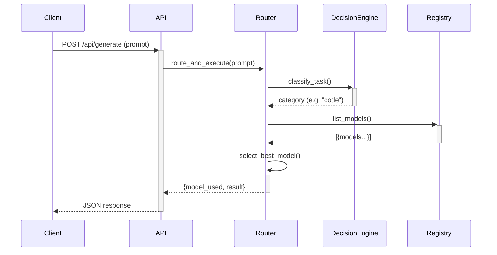

# LLM IntelliProxy — Architecture & Implementation Status

**Last Updated:** 2026-04-27  
**Status:** ✅ CLEANUP & REFACTOR COMPLETE

---

## 🎯 Project Overview

**IntelliProxy** is a production-grade, OpenAI-compatible LLM routing proxy that provides intelligent model selection, multi-provider abstraction, and comprehensive observability. Designed for the **28LLM** platform per [RULES_coding.md](RULES_coding.md) standards.

---

## 🏗️ Architecture (Post-Refactor)

```
┌─────────────────┐
│   Client Apps   │  Ollama / OpenAI SDKs
└────────┬────────┘
         │
         ▼
┌─────────────────────────────────────────────┐
│          API Gateway (api/app.py)           │
│  FastAPI app re-exporting from routes layer │
└────────┬─────────────────────────────────────┘
         │
         ▼
┌─────────────────────────────────────────────┐
│         Route Handlers (routes/)            │
│  • api.py  — Core endpoints & config       │
│  • web.py  — Dashboard endpoints            │
└────────┬─────────────────────────────────────┘
         │
         ▼
┌─────────────────────────────────────────────┐
│      Service Layer (services/)              │
│  • router.py          — IntelligentRouter    │
│  • decision_engine.py — LLM-based selection │
│  • registry.py        — Model CRUD + DB     │
│  • caches.py          — LRU + statistics    │
│  • database.py        — Schema & migrations │
│  • scheduler.py       — Background refresh  │
│  • config_loader.py   — YAML + ENV configs  │
│  • fallbacks.py       — Fallback store      │
│  • assessor.py        — AI model tagging    │
└────────┬─────────────────────────────────────┘
         │
         ▼
┌─────────────────────────────────────────────┐
│     Provider Adapters (providers/)          │
│  • ollama_provider.py   — Local Ollama      │
│  • nvidia_provider.py   — NVIDIA NIM Cloud  │
│  • base_provider.py     — Abstract base     │
└─────────────────────────────────────────────┘
```

**Design Principles**:
- Strict separation: Routes ≠ Services ≠ Providers
- Dependency injection via module-level setters (avoid circular imports)
- All I/O (DB, HTTP) encapsulated in dedicated service modules
- Global state initialized once at startup in `ollama_router.py`

---

## 📁 Project Structure

```
28-LLM-InteliProxy/
├── ollama_router.py          # Entry point & app glue (thin shim)
├── api/
│   └── app.py                # Re-exports api_app, web_app
├── routes/
│   ├── api.py                # API endpoint handlers
│   └── web.py                # Dashboard endpoint handlers
├── services/
│   ├── router.py             # IntelligentRouter core logic
│   ├── decision_engine.py    # LLM-based model selection
│   ├── registry.py           # Unified model registry (DB)
│   ├── database.py           # SQLite schema & migrations
│   ├── caches.py             # ClassificationCache, Statistics
│   ├── scheduler.py          # Background model refresh
│   ├── config_loader.py      # YAML config + env interpolation
│   ├── fallbacks.py          # Fallback configuration store
│   ├── assessor.py           # AI model assessment
│   ├── router_service.py     # Service wrapper for backward compat
│   ├── router_impl.py        # Factory shim for testability
│   ├── model_metadata.py     # Static model attributes
│   └── logging_config.py     # Structured JSON logging
├── providers/
│   ├── ollama_provider.py    # Ollama API adapter
│   ├── nvidia_provider.py    # NVIDIA NIM adapter
│   └── base_provider.py      # LLMProvider ABC
├── models/
│   └── schemas.py            # Pydantic request/response models
├── static/
│   ├── index.html            # Dashboard SPA
│   ├── app.js                # Dashboard logic (client-side)
│   └── models.json           # Static model catalog (optional)
├── config.yaml               # Main configuration (optional)
├── .env.example              # Environment variable template
├── requirements.txt          # Python dependencies
├── Makefile                  # Dev commands
├── Dockerfile                # Container build
├── docker-compose.yml        # Orchestration (CPU)
├── docker-compose.gpu.yml    # Orchestration (GPU)
├── README.md                 # User documentation
├── ARCHITECTURE.md           # This file
├── RULES_coding.md           # Coding standards
└── RULES_ports.md            # Port assignments (Proj 28)

```

---

## 🔄 Request Flow



**With LLM-based routing** (if `DECISION_MODEL` configured):
1. Decision engine builds dynamic system prompt from registry
2. Calls decision model (via provider)
3. Parses JSON response for `selected_model`
4. Falls back to heuristics if LLM call fails

---

## 💾 Database Schema

### `model_registry`
| Column | Type | Description |
|--------|------|-------------|
| `id` | TEXT | Model identifier (PK with provider) |
| `provider` | TEXT | Provider name (e.g. 'ollama') |
| `source_url` | TEXT | Provider base URL |
| `category` | TEXT | Auto-assigned category |
| `description` | TEXT | Human-readable description |
| `context_window` | INTEGER | Max context length |
| `last_seen` | TIMESTAMP | Last discovery timestamp |
| `enabled` | BOOLEAN | Include in routing |
| `assessed` | BOOLEAN | AI assessment completed |

### `decision_backlog`
| Column | Type | Description |
|--------|------|-------------|
| `id` | INTEGER PK | Auto-increment |
| `timestamp` | TIMESTAMP | Request time |
| `prompt_hash` | TEXT | MD5 of prompt prefix |
| `prompt_preview` | TEXT | First 200 chars |
| `selected_model` | TEXT | Chosen model |
| `provider` | TEXT | Provider used |
| `reason` | TEXT | Selection rationale |
| `latency_ms` | INTEGER | Routing latency |
| `token_count` | INTEGER | Approx tokens |
| `routing_mode` | TEXT | 'auto' | 'passthrough' |

### `request_metrics`
| Column | Type | Description |
|--------|------|-------------|
| `id` | INTEGER PK | Auto-increment |
| `timestamp` | TIMESTAMP | Request time |
| `model_id` | TEXT | Model that handled request |
| `provider` | TEXT | Provider name |
| `category` | TEXT | Task classification |
| `latency_ms` | INTEGER | Total execution time |
| `input_tokens` | INTEGER | Prompt tokens |
| `output_tokens` | INTEGER | Completion tokens |
| `success` | BOOLEAN | Whether request succeeded |
| `error_message` | TEXT | Error if failed |

**Indexes**: `idx_model_last_seen`, `idx_decision_timestamp`, `idx_metrics_timestamp`, `idx_metrics_model`

---

## 🧩 Core Components

### IntelligentRouter (`services/router.py`)
Routes requests to optimal models.
- **`discover_models()`** — Polls all providers, upserts to registry
- **`classify_task(prompt)`** — Returns category: code/vision/reasoning/general
- **`_select_best_model(category, complexity)`** — Scores models by speed & capability match
- **`route_and_execute(prompt, ...)`** — Main entry: selects model, executes via provider

### DecisionEngine (`services/decision_engine.py`)
Selects models using configured LLM.
- **`select_model(user_prompt)`** — Returns `{selected_model, reason, provider, latency_ms}`
- **`persist_decision(...)`** — Logs decision to DB
- Falls back to `IntelligentRouter` heuristics if LLM fails

### ModelRegistry (`services/registry.py`)
DB abstraction for model registry.
- **`upsert_model(...)`** — Insert or update model entry
- **`list_models()`** — Get all models sorted by last_seen
- **`mark_assessed(...)`** — Flag model as AI-assessed
- **`persist_decision(...)`** — Write to decision_backlog

### Scheduler (`services/scheduler.py`)
Background thread for periodic model refresh.
- Runs every 15 min (configurable)
- Calls `provider.list_models()` for all registered providers
- Triggers AI assessment for newly discovered models

---

## 🔌 Provider Interface

All providers implement `LLMProvider` ABC:

| Method | Purpose |
|--------|---------|
| `list_models()` | Return list of `{id, provider, category, description}` |
| `forward_request(model_id, payload, stream, endpoint)` | Proxy generate/chat request |
| `health_check()` | Quick liveness probe |

**Current Providers**:
- `OllamaProvider` — Local Ollama server (`http://localhost:11434`)
- `NvidiaProvider` — NVIDIA NIM cloud API (`https://integrate.api.nvidia.com/v1`)

---

## ⚡ Performance Optimizations

1. **Classification Cache** — LRU (2000-entry) prevents repeated LLM classification
2. **Model Score Cache** — Pre-computed attributes for instant model scoring
3. **HTTP Connection Pooling** — Single `httpx.AsyncClient` reused for all provider calls
4. **Model Warm-Up** — Pre-loads 3 fastest models at startup to eliminate first-call latency

---

## 📊 Observability

**Structured JSON Logs** (all services):
```json
{"timestamp":"...","level":"INFO","logger":"services.router","message":"Model selected","model":"qwen2.5-coder"}
```

**Health Endpoint** (`GET /health`):
```json
{
  "overall_status": "healthy",
  "proxy": {"status": "running", "port": 8128},
  "ollama": {"status": "running", "models": 12, "url": "..."},
  "airllm": {"status": "disabled"},
  "performance": {
    "classification_cache_hit_rate": "87.3%",
    "total_requests": 1420
  }
}
```

**Metrics** (`GET /stats`):
Per-model avg latency, total requests, category distribution, cache stats.

---

## 🔒 Security & Access Control

- **No Authentication** (by design for local deployment)
- **Header-based Override**: `X-LLMProxy-Model` bypasses routing (useful for admin/testing)
- **Input Validation**: Pydantic models enforce schema on all requests
- **SQLite Parameterization**: All DB queries use bound parameters

*For production deployments, place behind reverse proxy (nginx/Traefik) with authentication.*

---

## 🧪 Testing Strategy

```bash
# Unit tests (pytest)
pytest services/ tests/

# Integration test — full stack
pytest --integration

# Load test (locust)
locust -f tests/load_test.py
```

**Test Coverage Focus**:
- Decision engine accuracy (heuristic vs LLM)
- Fallback chain integrity
- Database migration safety (additive only)
- Provider adapters (mock responses)

---

## 🚀 Deployment

### Docker (Recommended)
```bash
docker-compose up -d
# Dashboard: http://localhost:8028
# API: http://localhost:8128
```

### Bare Metal
```bash
pip install -r requirements.txt
python ollama_router.py
```

### Kubernetes (Planned)
Helm chart with:
- HorizontalPodAutoscaler based on request rate
- PersistentVolume for SQLite DB
- ConfigMap for `config.yaml`
- Liveness/readiness probes on `/health`

---

## 📈 Roadmap

- [ ] Streaming responses (/api/generate with `stream: true`)
- [ ] Multi-provider load balancing (round-robin, latency-based)
- [ ] Prometheus metrics exporter
- [ ] Rate limiting per client IP
- [ ] Authentication/API keys
- [ ] Model fine-tuning registry
- [ ] Webhook notifications on critical failures

---

## 🤝 Contributing

Please read [CONTRIBUTING.md](CONTRIBUTING.md) (to be created) and follow the [RULES_coding.md](RULES_coding.md) standards.

All PRs require:
- ✅ Type hints
- ✅ Docstrings for public functions
- ✅ No circular imports
- ✅ Files ≤ 500 lines (ideal ≤ 200)
- ✅ Passing tests

---

<div align="center" style="margin-top:48px;color:var(--text-secondary);font-size:12px;">
**IntelliProxy** — Smarter routing. Maximum reliability. Zero hassle.
</div>
