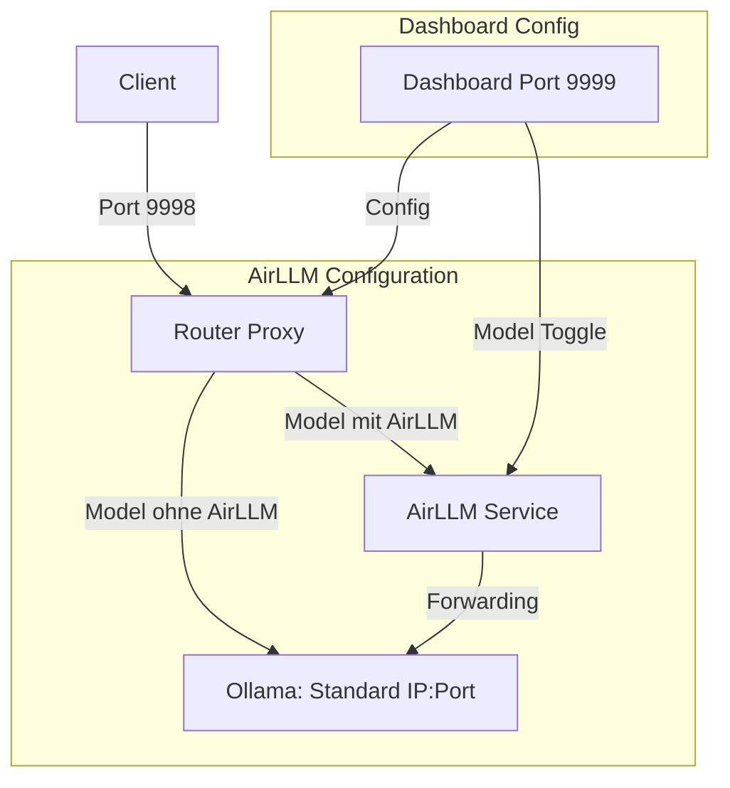

# AirLLM Integration Plan für Ollama IntelliProxy

## Zielsetzung

1. **Dezentrales Ollama-Connecting**: Konfiguration einer entfernten Ollama IP und Port im Dashboard
2. **AirLLM-Beschleunigung**: Pro-Modell-Aktivierung von AirLLM für große LLMs (70B+)
3. **Dashboard-UI**: Neue Konfigurationsseite im Dashboard

---

## Architektur-Übersicht



---

## Erforderliche Änderungen

### 1. Dashboard (static/index.html)

Neue Konfigurationsseite hinzufügen:

```html
<section id="airllm-config">
    <h2>AirLLM & Ollama Configuration</h2>
    
    <!-- Ollama Connection Settings -->
    <div class="card">
        <h3>Ollama Connection</h3>
        <p>Target Ollama IP and Port for decentralized connections</p>
        <input type="text" id="ollama-ip" placeholder="192.168.1.100" />
        <input type="number" id="ollama-port" placeholder="11434" />
        <button class="btn" onclick="saveOllamaConfig()">Save</button>
    </div>
    
    <!-- Model AirLLM Toggle -->
    <div class="card">
        <h3>AirLLM per Model</h3>
        <p>Enable AirLLM acceleration for specific models</p>
        <div id="model-airllm-list"></div>
    </div>
</section>
```

### 2. Router (ollama_router.py)

#### Neue Konfigurationsstruktur:

```python
# Ollama Connection Config
OLLAMA_TARGET = {
    "host": os.getenv("OLLAMA_HOST", "ollama"),
    "port": int(os.getenv("OLLAMA_PORT", "11434")),
    "use_airllm": os.getenv("OLLAMA_USE_AIRLLM", "false").lower() == "true"
}

# AirLLM Service Config
AIRLLM_CONFIG = {
    "enabled": False,
    "host": os.getenv("AIRLLM_HOST", "localhost"),
    "port": int(os.getenv("AIRLLM_PORT", "8000"))
}

# Model-specific AirLLM settings
MODEL_AIRLLM_CONFIG = {}  # {"model_name": True/False}
```

#### Routing-Logik:

```python
def get_model_endpoint(model_name: str) -> str:
    """Determine which endpoint to use based on model config"""
    if MODEL_AIRLLM_CONFIG.get(model_name, False):
        return f"http://{AIRLLM_CONFIG['host']}:{AIRLLM_CONFIG['port']}"
    else:
        return f"http://{OLLAMA_TARGET['host']}:{OLLAMA_TARGET['port']}"
```

### 3. API-Endpunkte (ollama_router.py)

Neue Endpunkte:

```python
# Get AirLLM Configuration
@app.get("/config/airllm")
async def get_airllm_config():
    return {
        "ollama_host": OLLAMA_TARGET["host"],
        "ollama_port": OLLAMA_TARGET["port"],
        "airllm_host": AIRLLM_CONFIG["host"],
        "airllm_port": AIRLLM_CONFIG["port"],
        "model_config": MODEL_AIRLLM_CONFIG
    }

# Update Ollama Target
@app.post("/config/ollama")
async def update_ollama_config(config: OllamaConfig):
    OLLAMA_TARGET["host"] = config.host
    OLLAMA_TARGET["port"] = config.port

# Update Model AirLLM Toggle
@app.post("/config/model/airllm")
async def update_model_airllm(model_config: ModelAirLLMConfig):
    MODEL_AIRLLM_CONFIG[model_config.model_name] = model_config.enabled
```

### 4. Frontend JavaScript (static/app.js)

```javascript
// AirLLM Configuration
let airllmConfig = {
    ollama_host: "ollama",
    ollama_port: 11434,
    airllm_host: "localhost",
    airllm_port: 8000,
    model_config: {}
};

// Fetch AirLLM config
async function fetchAirLLMConfig() {
    const response = await fetch(`${APP_CONFIG.apiUrl}/config/airllm`);
    airllmConfig = await response.json();
    renderAirLLMConfig();
}

// Save Ollama Config
async function saveOllamaConfig() {
    await fetch(`${APP_CONFIG.apiUrl}/config/ollama`, {
        method: 'POST',
        headers: {'Content-Type': 'application/json'},
        body: JSON.stringify({
            host: document.getElementById('ollama-ip').value,
            port: parseInt(document.getElementById('ollama-port').value)
        })
    });
}

// Toggle AirLLM per model
async function toggleModelAirLLM(modelName, enabled) {
    await fetch(`${APP_CONFIG.apiUrl}/config/model/airllm`, {
        method: 'POST',
        headers: {'Content-Type': 'application/json'},
        body: JSON.stringify({
            model_name: modelName,
            enabled: enabled
        })
    });
}
```

---

## Implementierungs-Reihenfolge

1. **Backend: Neue Konfigurationsstruktur** in `ollama_router.py`
   - `OLLAMA_TARGET` Dictionary
   - `AIRLLM_CONFIG` Dictionary
   - `MODEL_AIRLLM_CONFIG` Dictionary

2. **Backend: Neue API-Endpunkte**
   - `GET /config/airllm`
   - `POST /config/ollama`
   - `POST /config/model/airllm`

3. **Backend: Routing-Logik anpassen**
   - `get_model_endpoint()` Funktion
   - Integration in `OllamaRouter`

4. **Frontend: Dashboard HTML erweitern**
   - Neue Sektion in `static/index.html`
   - Eingabefelder für IP/Port
   - Toggle-Liste für Modelle

5. **Frontend: JavaScript erweitern**
   - `fetchAirLLMConfig()`
   - `saveOllamaConfig()`
   - `toggleModelAirLLM()`

---

## Dateien die geändert werden müssen

| Datei | Änderungen |
|-------|------------|
| `ollama_router.py` | Neue Config-Struktur, API-Endpoints, Routing-Logik |
| `static/index.html` | Neue Config-Sektion für AirLLM |
| `static/app.js` | Neue JavaScript-Funktionen für Config-Management |
| `docker-compose.yml` | (Optional) AirLLM-Service hinzufügen |
| `requirements.txt` | (Optional) airllm dependency falls benötigt |

---

## Hinweise

- Die Konfiguration wird im Speicher gehalten (nicht persistent)
- Für persistente Konfiguration kann eine JSON-Datei oder Datenbank verwendet werden
- AirLLM muss separat als Service laufen (Docker-Container oder lokal)
- Die Standard-Ollama-Verbindung bleibt als Fallback erhalten
